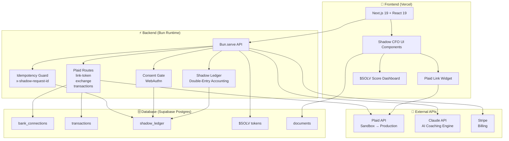
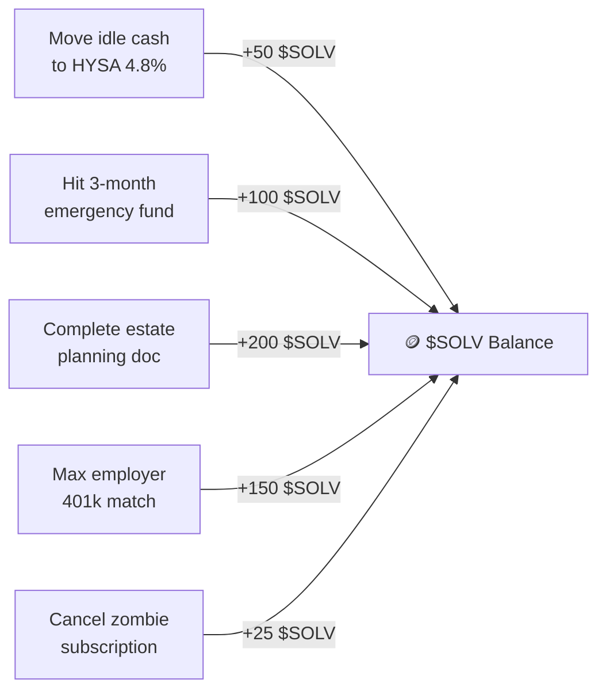
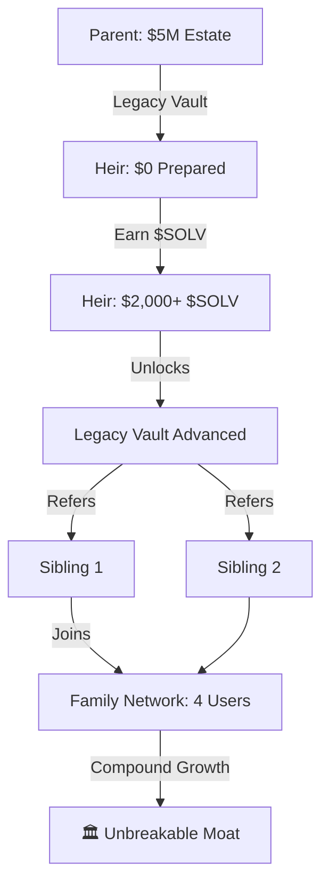
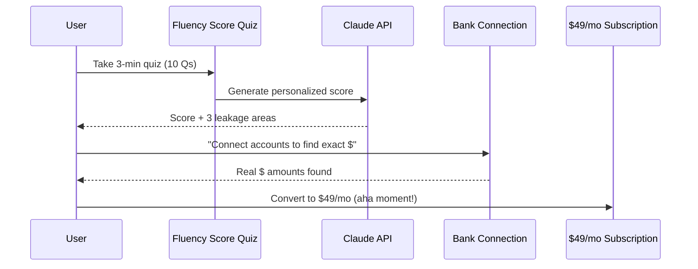
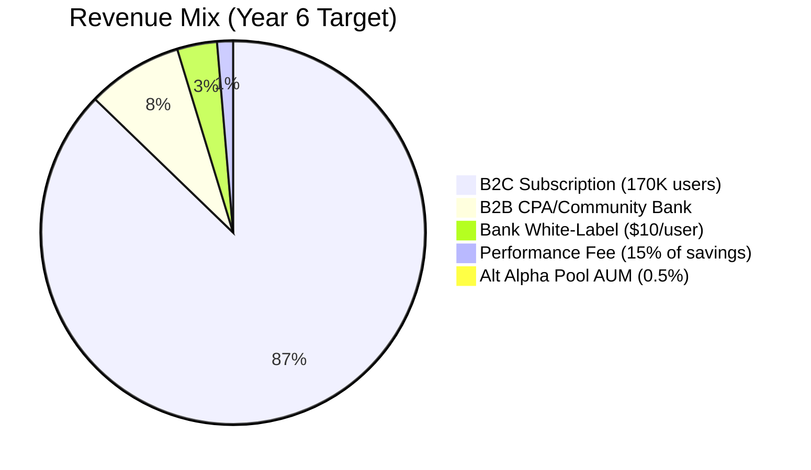
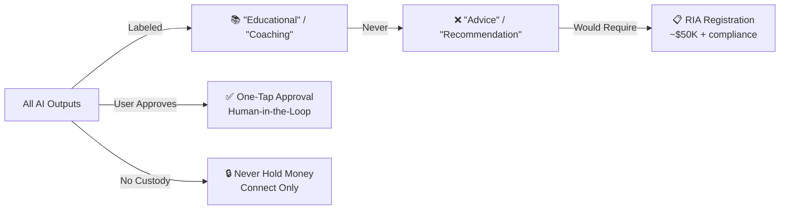

# 🌑 Shadow CFO — Agentic Wealth OS


<p align="center">
  
  
  
  
</p>

---

## 🔥 What Is Shadow CFO?

> **The first Agentic Wealth OS that doesn't just show you problems — it fixes them.**
> 
> For the 45 million Americans earning too much for Dave Ramsey and too little for Goldman Sachs.

### 🎯 One-Sentence Definition

**Shadow CFO** is an **Agentic Wealth OS** — a subscription platform that connects to every financial account, finds **$7,800–$21,800 in annual financial leakage**, acts on it with user approval, and builds behavioral wealth habits through a soul-bound token system (**$SOLV**) that compounds into generational wealth.

### ⚡ The Core Distinction

| Competitors | Shadow CFO |
|-----------|--------------|
| 📊 **Show** you a dashboard of problems | 🔍 **Finds** the problem, **drafts** the action, **executes** with one-tap approval |
| 📈 27% Day-30 retention | 🚀 **70%+ retention** through $SOLV gamification |
| 💸 $400/hr CFP or 0.89% AUM | 💎 **$49/mo** flat fee — effectively free vs. traditional advice |

---

## 🏗️ Architecture

### System Architecture (Mermaid Diagram)



### 🎨 Tech Stack

| Layer | Technology | Purpose |
|-------|-------------|---------|
| **Frontend** | Next.js 19, React 19, Tailwind CSS 4 | UI rendering, responsive design |
| **Backend** | Bun 1.3.11, TypeScript 5 | High-performance API routes |
| **Database** | Supabase (Postgres + RLS) | Auth, data storage, real-time |
| **Banking** | Plaid API 42.2.0 | Account connection, transaction sync |
| **AI** | Claude API (claude-sonnet-4-6) | Coaching engine, leakage detection |
| **Payments** | Stripe | Subscription billing ($49/mo) |
| **Deployment** | Vercel (frontend), Railway/Fly.io (backend) | Global edge network |
| **Analytics** | PostHog (self-hosted) | User behavior tracking |

> ⚠️ **Architecture Note:** Bun.serve backend runs separately from Vercel frontend. For production, deploy backend to Railway or Fly.io.

---

## 🪙 The $SOLV Token — Behavioral Moat

### What It Is
A **non-transferable, soul-bound utility token** (NOT cryptocurrency, NOT a security):
- 📜 Structured as "membership credential" under GENIUS Act + SEC Clarity Act
- 🚫 Cannot be bought, sold, or transferred — only **earned** through financial health actions
- ✅ Legal because: zero monetary value, no transfer mechanism, purely credential/badge system

### 🎮 How Users Earn $SOLV



### 🚀 Tier Unlocks (Multipliers)

| Tier | $SOLV Required | Unlocks |
|------|-----------------|---------|
| 🥉 **Bronze** | 0–499 | Basic leakage detection, Fix Queue access |
| 🥈 **Silver** | 500–999 | + Alt Alpha Pool (real estate, private credit, art) |
| 🥇 **Gold** | 1,000–1,999 | + Institutional rates, zero-fee Alt Alpha Pool |
| 💎 **Platinum** | 2,000+ | + Legacy Vault, priority AI coaching, family estate tools |

### 🔒 Why $SOLV Is the Real Moat
- **Non-replicable** externally without rebuilding from scratch
- **Switching costs compound** — longer you're in, more you've earned
- **Behavioral commitment device** — Stanford/Benartzi research validated
- **BlackRock data**: Clients taking 6+ deliberate actions/quarter accumulate **3.2× more wealth** over 10 years

---

## 🏛️ The Legacy Vault — Family Network Moat

### What It Is
A feature where parents can "drip-feed" inheritance to heirs based on heir's $SOLV score:
- 👨‍👩‍👧 Both parent and heir must be in the platform — creates **family-level network effect**
- 🌉 Once a parent-child pair is in, churn drops **near zero** (gravity)
- 🏦 No competitor has this feature

### Network Effect Visualization



> 💡 **White-Label Opportunity:** Regional banks pay **$10/user/month** to retain heir-generation assets.

---

## 🎯 Target Market

### Primary Segment: HENRYs (High Earners, Not Rich Yet)

<p align="center">
  
  
  
</p>

| Characteristic | Detail |
|---------------|--------|
| **Income** | $75K–$250K household (NOT $250K+ — they have Merrill Lynch) |
| **Age** | 25–50, primarily Millennials and Gen X |
| **Assets** | $100K–$2M spread across 3–7 disconnected platforms |
| **Psychology** | Smart, informed, **ashamed** of financial gaps, distrustful of "salesy" institutions |

### 🚀 Beachhead: Women 35–50

| Metric | Value |
|--------|-------|
| **Literacy Gap** | 10-point gap vs men (45% vs 53% on P-Fin Index) |
| **Assets Controlled** | $10T+ in U.S. assets |
| **Word-of-Mouth** | Highest viral coefficient of any demographic |
| **Market Gap** | Ellevest shut down robo-investing wing — **wide open** |

---

## 💸 Financial Leakage Table

> The average user leaks **$7,800–$21,800 annually**. Shadow CFO finds and fixes it.

| 🔥 Leakage Category | 💔 How It Happens | 💰 Annual Cost | ✅ Shadow CFO Fix |
|---------------------|-------------------|-----------------|---------------|
| **Tax Drag** | No loss harvesting, wrong account type | $3,000–$8,000 | AI identifies tax-lot opportunities, user approves one-tap rebalance |
| **Cash Drag** | Idle savings at 0.01% vs HYSA at 4.8% | $1,200–$3,000 | AI calculates idle cash, shows HYSA gain, links to transfer |
| **Fee Drag** | Active funds at 0.8–1.2% vs index at 0.03% | $800–$2,500 | AI cross-references every holding's expense ratio vs lowest-cost |
| **Employer Match Neglect** | Contributing below match threshold — 100% return left on table | $1,500–$4,000 | AI calculates exact match gap, shows loss per pay period |
| **Debt Cost Drag** | High-interest debt while cash sits in low-yield savings | $1,000–$3,500 | AI compares debt rate vs savings yield, flags arbitrage |
| **Operational Errors** | Late fees, wrong routing, zombie subscriptions | $300–$800 | AI scans 24 months of transactions for fee patterns |
| **🎯 TOTAL** | | **$7,800–$21,800** | **Found and queued within 72 hours of Plaid connection** |

---

## 🚀 The Fluency Engine — Acquisition Layer

### How the Funnel Works



1. **🎮 Free Fluency Score Quiz** (10 questions, P-Fin Index based, 3 minutes)
2. **📊 Personalized Score** + 3 specific leakage areas identified by Claude API
3. **💡 Conversion Bridge:** "Your score suggests ~$X in likely leakage. Connect accounts — we'll find the exact amount."
4. **🔗 Plaid Connection** = the real "aha moment" = specific dollar amounts from real accounts
5. **💎 $49/mo Subscription** converts from specificity (not generic advice)

> 🌉 **Virality:** Shareable result card creates organic distribution without paid ads.

---

## 💰 Revenue Model

### Pricing Tiers

| Tier | Price | Who | Why |
|------|-------|-----|-----|
| **🆓 Free** | $0 | Quiz takers | Acquisition hook. No account connection needed. |
| **💎 Core** | $49/mo | HENRYs | Compared to $400/hr CFP = effectively free. Signals serious value. |
| **🏛️ Family** | $79/mo | Legacy Vault users | Adds family dashboard, estate planning tools. |
| **🏢 B2B CPA** | $499–$999/mo | CPA firms | White-label Fluency Engine for client education. |
| **🏦 B2B Bank** | $10/user/mo | Regional banks | White-label heir retention product. |

> 💡 **Why NOT $9.99:** At $9.99, you need 833,000 subscribers for $100M ARR. At $49, you need 170,000. Pricing is a **positioning statement**.

### Revenue Streams



---

## 📅 90-Day Sprint Plan

### 🎯 Phase 1: Foundation (Week 1–2)
- [x] Register domain (privacy-protected)
- [ ] Framer landing page: "Find your Financial Fluency Score — free"
- [ ] Typeform quiz: 10 questions using P-Fin Index
- [ ] Connect Typeform → Make.com → Claude API
- [ ] Personalized score + 3 leakage areas per user

### 🚀 Phase 2: First 100 Users (Week 3–4)
- [ ] 100 beta users from personal network
- [ ] PostHog tracking: quiz completion (45%+), score share (20%+), Plaid connection (15%+)
- [ ] 3 user interviews: "Would you pay $49/mo?"
- [ ] Decision checkpoint: proceed OR pivot

### 🎯 Phase 3: Beachhead (Week 5–8)
- [ ] Soft launch to women's finance Facebook groups + LinkedIn
- [ ] "Founding Member" rate: $29/mo for first 100 users
- [ ] Partner with 2 micro-influencers (10K–50K followers, 30% rev share)
- [ ] "30-Day Money Blind Spot Challenge" in private community

### 🏢 Phase 4: B2B First Contact (Week 9–12)
- [ ] Draft B2B one-pager for CPA firms
- [ ] Personalized email to 20 CPA firms
- [ ] Q1 target: 500 registered users, 75 paying ($3,675 MRR), 2 B2B pilots

---

## 🏆 Competitive Landscape

### The "Missing Middle" We Own

<p align="center">
  
  
  
</p>

| Competitor | What They Do | Price | Their Fatal Gap | Our Edge |
|-----------|----------------|-------|-----------------|----------|
| **Empower** | Free aggregation + AUM wealth mgmt | Free / 0.89% AUM ($100K min) | AUM misaligns incentives. No agentic AI. No $SOLV. | Flat fee. AI acts. $SOLV progression. No sales call. |
| **Wealthfront** | Robo-advisor, tax-loss harvesting | 0.25% AUM | Only investable assets. Ignores checking/savings. | Whole financial life. Coaching + action across every account. |
| **Monarch Money** | Best-in-class budgeting | $14.99/mo | Purely reporting. No action capability. | We are Monarch + AI that acts. $49 vs $15 = 10× value. |
| **Shadow CFO (us)** | **Agentic Wealth OS** | **$49/mo core** | **The gap we own**: agentic execution + flat fee + behavioral engine | **Only product: real data + AI action + $SOLV + Legacy Vault** |

---

## 🛡️ Regulatory Framework

### The Legal Lane: "Education and Coaching" — Not "Advice"



### Compliance-as-Code Framework

| Regulatory Requirement | Shadow CFO Implementation |
|--------------------------|-------------------------------|
| **Transparency (CMA)** | AI must disclose when acting autonomously |
| **Human Oversight (SEC)** | "High-risk" decisions require human approval |
| **Explainable AI (CFPB)** | Every recommendation includes "Here's why:" |
| **Data Protection (NIST)** | Biometric auth, SOC 2 Type II, money transfer locks |

> ⚠️ **One Non-Negotiable:** Hire a fractional compliance lawyer at $500/month the moment Plaid integration goes live.

---

## 🚀 Three-Phase Growth Roadmap

### Phase 1 (Month 1–12): The Hook
- 🎮 Fluency Engine as free viral acquisition
- 🎯 Target: Women 35–50 first
- 🛠️ No-code monolith (Bubble.io + Supabase)
- 📊 **Target:** 2,000 paying users · $49/mo · **$1.2M ARR run-rate**

### Phase 2 (Month 13–30): The Engine
- 🔗 Plaid integration live (real aha moment)
- 🤖 AI coaching engine → Python FastAPI (Month 6)
- 🪙 $SOLV token system live
- 🏢 B2B white-label for 5 CPA firms + 1 community bank
- 🌎 Spanish language layer live
- 📊 **Target:** 15,000 paying users · $49 avg · **$8.8M ARR**

### Phase 3 (Month 31–72): The Moat
- 🏛️ Legacy Vault creates family pairs — churn drops near zero
- 🏦 Bank white-label signed ($10/user/mo)
- 💎 Alt Alpha Pool opens ($SOLV tier unlocks)
- 🏢 B2B expands to 50+ employer wellness contracts
- 💰 **Target:** 170,000 paying users · blended $65 ARPU · **$130M ARR run-rate**

### Exit Strategy (2031–2032)
**Target Acquirers:** X Money (Musk), JP Morgan, BlackRock, Fidelity, Visa/Mastercard  
**What They're Buying:** 2M+ users' financial behavioral data, $SOLV history, Legacy Vault family graph, bank white-label relationships  
**Valuation:** $130–150M ARR at 6–8× multiple = **$780M–$1.2B acquisition**

---

## 🛠️ Quick Start

### Prerequisites
- Node.js 18+ or Bun 1.3.11+
- Supabase account
- Plaid account (sandbox for development)
- Stripe account

### Environment Variables

Create `.env` file (never commit this!):

```bash
# Plaid
PLAID_CLIENT_ID=your_client_id
PLAID_SECRET=your_secret
PLAID_ENV=sandbox

# Supabase
NEXT_PUBLIC_SUPABASE_URL=https://xxx.supabase.co
NEXT_PUBLIC_SUPABASE_ANON_KEY=your_anon_key
SUPABASE_SERVICE_ROLE_KEY=your_service_role_key
```

### Install & Run

```bash
# Install dependencies
bun install

# Run Bun backend (Plaid routes)
bun run dev

# Build for production
bun run build

# Run tests
bun test
```

### Database Migrations

```bash
# Apply Supabase migrations
supabase db push
```

---

## 📚 Documentation

| Document | Description |
|----------|-------------|
| `CLAUDE.md` | Technical design doc, build order, coding standards |
| `docs/adr/ADR-001-solv-non-security.md` | $SOLV token non-security classification |
| `docs/adr/ADR-002-cfpb-1033-contingency.md` | CFPB 1033 compliance contingency |
| `docs/adr/ADR-003-mst-classification-defense.md` | MST (Monetary or Security Token) defense |

---

## 🎨 UI Screenshots

<p align="center">
  
</p>

### Key UI Features
- 🎯 **Ghost Money Scanner:** Drag-and-drop upload, real-time leakage detection
- 📊 **$SOLV Score Dashboard:** Gamified progress, tier unlocks
- 🔗 **Connect Bank:** Plaid Link integration, real-time sync
- 🛠️ **Fix Queue:** One-tap approvals, human-in-the-loop
- 🏛️ **Legacy Vault:** Family network, inheritance drip-feed

---

## 🤝 Contributing

Shadow CFO is currently a **solo-founded project**. We're not hiring or seeking co-founders.

### For Contractors
- 1 part-time contractor via Toptal/Contra (10–15 hours/month at $50/hr)
- Claude writes the full technical spec; contractor executes
- Never need a full-time CTO until $50K+ MRR

### For Users
- Beta testing: Sign up at [shadow-cfo.vercel.app](https://shadow-cfo.vercel.app)
- Feedback: Open an issue in this repo
- Security: Report vulnerabilities to security@shadowcfo.com

---

## 📞 Contact & Social

<p align="center">
  <a href="https://shadow-cfo.vercel.app">
    
  </a>
  <a href="https://linkedin.com/company/shadowcfo">
    
  </a>
  <a href="https://twitter.com/shadowcfo">
    
  </a>
  <a href="https://github.com/vim719/ShadowCFO">
    
  </a>
</p>

---

## 📜 License

MIT License — see LICENSE file for details.

---

<div align="center">
  <h3>🌑 Shadow CFO — The First Agentic Wealth OS</h3>
  <p><em>"Don't just see your money. Train it."</em></p>
  
</div>
